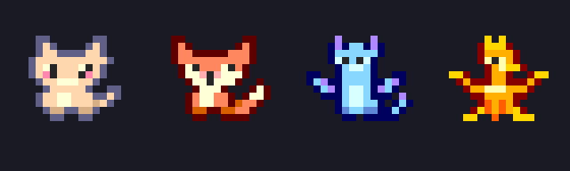

# pi-pet

[](https://github.com/how1215/pi-pet/actions/workflows/ci.yml)


**A tiny pixel companion for every pi session. No extra tokens. Just CS jokes.**

為 [pi coding agent](https://github.com/earendil-works/pi-mono) 製作的像素寵物插件：每個 session 抽一隻，陪你寫程式，偶爾說句 Computer Science 冷笑話。



*四款寵物的像素美術預覽，非終端實機截圖。由左至右：快取貓、堆疊狐、位元龍、核心鳳凰。*

## Features

- **Session 專屬**：首次載入加權抽選，恢復已保存 session 或 `/reload` 不重抽。
- **右下角浮動**：不搶鍵盤焦點、不修改正在輸入的文字。
- **16×12 像素美術**：半方塊繪成 16×6 字元格，ANSI 256 色，不依賴 emoji 或圖片協定。
- **CS 冷笑話**：24 句本機台詞，不連續重複；泡泡 5 秒後消失，互動時眨眼。
- **零額外模型呼叫**：不新增工具，不把寵物活動塞進模型上下文。
- **排版保護**：固定尺寸、按顯示字寬換行，小視窗自動隱藏。

> 「我沒有拖延，我在 lazy evaluation。」
>
> 「不是忘記你，是 cache miss。」
>
> 「你是我的 base case，不然我會無限遞迴。」

## Install

需要 pi；開發與自動測試以 **pi 0.85.1、Node.js ≥22.19.0** 為基準。

```sh
pi install https://github.com/how1215/pi-pet
```

回到 pi 執行 `/reload`。只想在特定專案使用，可加 `-l`：

```sh
pi install -l https://github.com/how1215/pi-pet
```

若已有手動安裝的 `session-pet`，請先移除或停用舊副本，避免重複註冊 `/pet` 與快捷鍵。
插件只在互動 TUI 啟用；print、JSON、RPC 模式不建立寵物或計時器。

移除：

```sh
pi remove https://github.com/how1215/pi-pet
```

專案級安裝請使用 `pi remove -l`，接著 `/reload`。

## Controls

| 操作 | 效果 |
| --- | --- |
| `/pet` | 切換顯示／隱藏；不換寵物、不說話 |
| `Ctrl+/` | 寵物顯示時說一句冷笑話並眨眼 |

再次互動會切換台詞並重新計時。隱藏時快捷鍵不會喚回寵物；顯示狀態不跨重載保存。

### Terminal.app 快捷鍵限制

部分終端將 `Ctrl+/` 與 `Ctrl+_`／pi 的 `Ctrl+-` 復原傳成同一控制碼（`0x1f`）。插件不攔截此控制碼，以保留復原功能。

若 `Ctrl+/` 無效或觸發復原，需讓終端傳送獨立的按鍵序列：

- modifyOtherKeys：`ESC [27;5;47~`
- Kitty keyboard protocol：`ESC [47;5u`

在 Terminal.app「設定 → 描述檔 → 鍵盤」可設定 Control + `/` 的「傳送文字」動作。
其中 `ESC` 必須是實際 Escape 控制字元，而不是字母 `ESC` 或字面 `\x1b`。不同終端的設定方式可能不同。

## Meet the pets

| 稀有度 | 機率 | 寵物 | 配色 |
| --- | ---: | --- | --- |
| N | 60% | 快取貓 / Cache Cat | 奶油、粉紅 |
| R | 25% | 堆疊狐 / Stack Fox | 橘紅、米白 |
| SR | 12% | 位元龍 / Byte Dragon | 冰藍、紫色 |
| SSR | 3% | 核心鳳凰 / Kernel Phoenix | 金黃、火紅 |

稀有度只影響外觀；沒有重抽、收集、付費或養成懲罰。

## Engineering notes

```text
session_start
  ├─ restore custom entry, or draw + appendEntry
  └─ zero-height widget owns two non-capturing overlays
       ├─ pet: 22 columns × 8 rows
       └─ speech: 38 columns, at most 6 rows

Ctrl+/ → choose joke → blink → expire speech
/pet   → toggle visibility and clear speech
session_shutdown / widget disposal → remove overlays + clear timers
```

- `index.ts`：事件、快捷鍵、浮動層與資源清理。
- `pets.ts`：像素圖、配色、機率、狀態驗證、台詞池。
- `view.ts`：ANSI 半方塊繪圖、中英文字寬、泡泡排版。
- `tests/run.mjs`：16 項檢查，含 pi 原生 loader 與 regular-mode TUI。

用零高度 widget 取得公開 TUI factory 與 dispose hook，再建立 non-capturing overlays，避免把常駐寵物變成永久阻塞的 `custom()` prompt。待機不持續刷新。

狀態以 `pi.appendEntry("session-pet:v1", ...)` 保存，不進入模型上下文。讀取所有 session entries，使同一 session 內 `/tree` 導航不重抽。
`/fork`／`/clone` 若保留寵物 entry，便繼承原寵物；若從插件啟用前的位置分叉，則抽新的。`--no-session` 不跨程序保存。

## Limitations

- Overlay API 仍屬實驗性，並非所有 pi 版本或終端都已驗證。
- 最低顯示尺寸為 **60 欄 × 24 行**；縮小時隱藏，放大後恢復。
- 右邊保留 2 欄，下方保留 4 行。浮動層是矩形，不是真正逐像素透明，仍可能遮住內容或長輸入框；可用 `/pet` 隱藏。
- Extension 阻塞式 UI 期間暫時隱藏；內建選單與終端原生捲動歷史不保證常駐可見。
- 使用等寬字型與標準 Unicode 字寬設定。自動排版測試不等於所有終端的實機驗收。

## Development

```sh
git clone https://github.com/how1215/pi-pet.git
cd pi-pet
npm ci
npm run check
```

`check` 執行 TypeScript 型別檢查與測試。CI 使用 Node.js 22、24。

測試涵蓋：像素尺寸、1～120 欄寬的 ANSI/CJK 排版、機率邊界、不重複台詞、session 還原、toggle、泡泡計時、資源清理、焦點、縮放與原生插件載入。

本機試用（不修改 pi 安裝設定）：

```sh
pi -e ./index.ts
```

手動驗收建議：輸入未送出的中文時互動、模型串流期間切換、縮放視窗、重載／恢復 session；確認文字、游標與寵物狀態保持正常。

## Credits & license

Created by **how1215** with AI-assisted implementation, pixel-art iteration, and testing. The code uses pi's documented extension APIs and public examples as implementation references.

[MIT License](LICENSE). This is an independent community project, not an official pi component.
